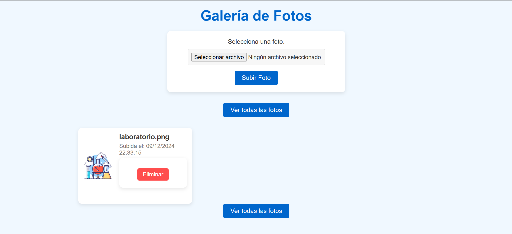
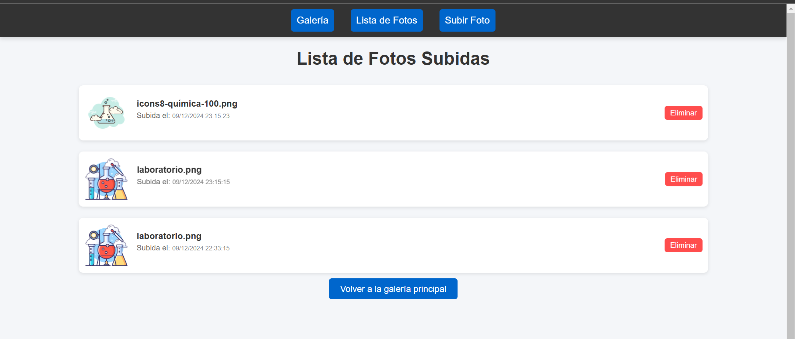

# PokeApp

Con esta App podrás insertar, consultar y eliminar pokemons en una base de datos

## Instalación

1. Clona el repositorio:
    ```bash
    git clone https://github.com/tu-usuario/subidaDeArchivos.git
    ```

2. Navega al directorio del proyecto:
    ```bash
    cd subidaDeArchivos
    ```

3. Instala las dependencias de Composer:
    ```bash
    composer install
    ```

4. Copia el archivo `.env.example` a `.env` y configura tu base de datos y otras variables de entorno:
    ```bash
    cp .env.example .env
    ```

5. Genera la clave de la aplicación:
    ```bash
    php artisan key:generate
    ```

6. Ejecuta las migraciones de la base de datos:
    ```bash
    php artisan migrate
    ```

7. Inicia el servidor de desarrollo:
    ```bash
    php artisan serve
    ```

## Diseño interfaz
Aquí observamos el inicio


Aquí observamos como borra


Aquí observamos como se ve la galería de las fotos



